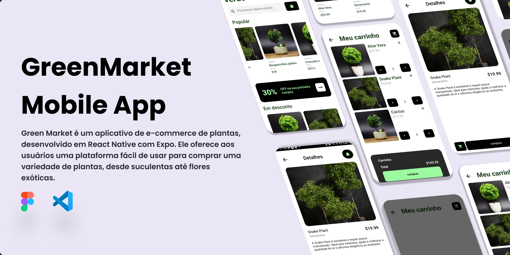
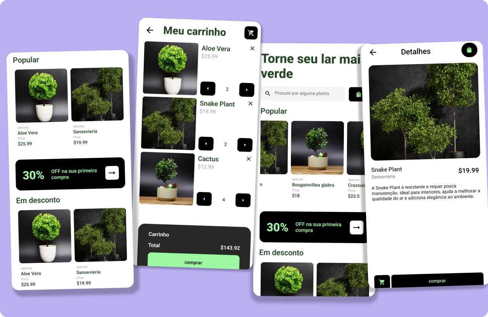

# 🛒🌱 GreenMarket

GreenMarket é um marketplace de plantas com funcionalidades integradas de cuidados, desenvolvido em **React Native** com o **Expo**. O aplicativo permite que usuários comprem plantas e recebam lembretes personalizados para garantir o cuidado ideal de cada uma delas.

## Projeto


## Telas


## 🎯 Objetivo

GreenMarket busca criar uma experiência completa para os amantes de plantas:
- **Marketplace de plantas** com informações detalhadas e sugestões de cuidados.
- **Lembretes personalizados** de rega, adubação e manutenção.
- **Sistema de notificações** para facilitar o acompanhamento dos cuidados.
- Informações sobre temperatura e umidade para cuidados adequados ao ambiente do usuário.


## 🚀 Funcionalidades

- **Compra de plantas**: Usuários podem explorar e comprar uma variedade de plantas.
- **Cadastro de Plantas**: Adicione suas plantas com informações personalizadas, incluindo nome, categoria, e preferências de cuidados.
- **Notificações Automáticas**: Notificações com o **Expo Push Notification** lembram de regar as plantas no horário desejado.
- **Diagnóstico**: Ferramenta para análise de problemas das plantas, oferecendo sugestões de cuidados.
- **Conexão com API**: Dados atualizados de temperatura e umidade, para um cuidado mais eficaz com base nas condições do ambiente.
- **Carrinho e pagamento**: Compra facilitada com um sistema seguro de pagamento integrado.

## 📲 Como Funcionam as Notificações

Utilizando o **Expo Push Notification**, o MyGarden envia lembretes automáticos para que o usuário cuide de suas plantas. Os horários são configurados pelo usuário e, em seguida, programados no sistema de notificações do Expo. O aplicativo permite:
- **Agendar notificações** de acordo com o horário e frequência de rega de cada planta.
- **Personalizar o conteúdo** de cada notificação para incluir informações específicas da planta e do tipo de cuidado necessário.

## 🎨 Figma

Para uma prévia do design do projeto, acesse o link do Figma do MyGarden:

[Link do Figma](https://www.figma.com/design/Qin65lBahkF23IHzEzc856/MyGarden?m=auto&t=GWM51klT1fFaVYGl-1)


## 📝 Como Contribuir
Faça um fork do projeto.
```tsx
git clone https://github.com/Dom-Garotom/MyGarden.git
````
Crie uma branch para a nova funcionalidade: 
```tsx
git checkout -b minha-feature.
````
Faça commit das suas alterações: 
```tsx
git commit -m 'Adicionar nova funcionalidade'.
````
Envie para o branch principal: 
```tsx
git push origin minha-feature.
```
Abra um pull request.
